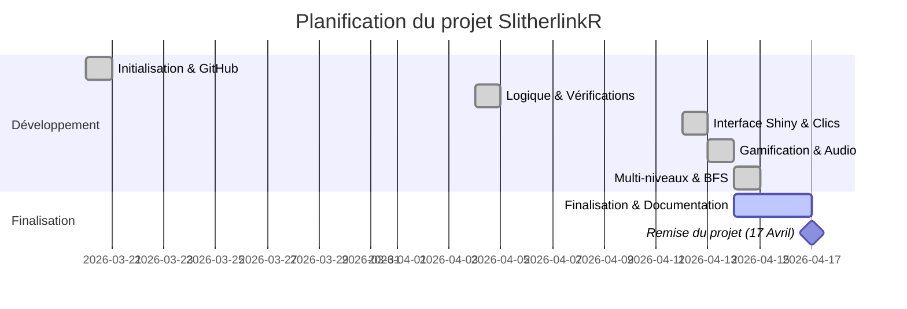
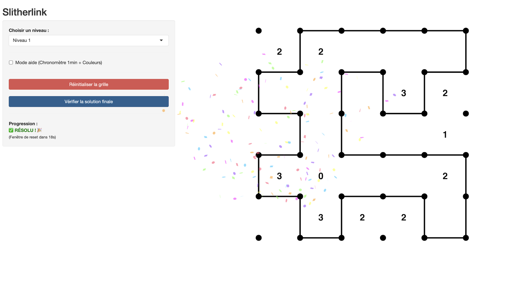

# SlitherlinkR : Application Interactive Slitherlink 🧩

Exploration de la logique combinatoire à travers le développement d'un moteur de jeu et d'une interface web interactive sous R.

## 🎯 Description du projet / Objectif

Ce projet s'inscrit dans le cadre du Master 1 SSD (2025-2026) à l'Université de Montpellier. Il consiste en la création d'une bibliothèque en langage R servant de fondation à une application **Shiny** dédiée au jeu de puzzle logique **Slitherlink**.

L'objectif est de traduire des contraintes de voisinage et des règles topologiques (théorie des graphes) en algorithmes de vérification robustes, tout en offrant une expérience utilisateur fluide et ludique.

Les trois objectifs principaux sont :
*   **Développement d'une Bibliothèque R** : Création de fonctions modulaires pour la génération de grilles et la vérification des règles.
*   **Moteur de Vérification** : Implémentation d'algorithmes de parcours (BFS) pour garantir l'unicité de la boucle fermée.
*   **Interface Shiny Interactive** : Développement d'une UI permettant la manipulation des segments, avec retour visuel en temps réel et gamification.

## 👥 Membres de l'équipe et rôles

| Nom | Rôle Principal |
| :--- | :--- |
| **Yonkeu-Waya Kevin-Roseverlt** | Architecture du package, Logique algorithmique, Interface Shiny & Pipeline GitHub |

*(Note : L'ensemble des tâches de conception, de codage et de documentation a été effectué en autonomie complète.)*

## 📜 Règles du Slitherlink

Le jeu repose sur une grille de points où l'objectif est de tracer une boucle unique.

*   **Contrainte locale** : Chaque nombre dans une case indique combien de ses quatre côtés appartiennent à la boucle.
*   **Règle des points** : À chaque intersection, on doit avoir exactement **0 ou 2** segments (pas de croisement, pas de cul-de-sac).
*   **Boucle unique** : Tous les segments tracés doivent former une seule et unique boucle fermée qui ne se ramifie jamais.

## 🛠️ Choix des langages et packages

**Langage principal : R**

*   **shiny** : Pour la création de l'application web interactive.
*   **ggplot2** : Pour le rendu graphique dynamique de la grille et des segments.
*   **usethis & devtools** : Pour la structuration du projet aux normes des packages R officiels.
*   **canvas-confetti** (via JS) : Pour l'implémentation de la gamification (effets de victoire 🎉).
*   **git / github** : Pour le versionnement et la gestion collaborative du code.

## ⚙️ Pipeline général

1.  **Initialisation du Package** : Structuration de l'arborescence (R/, man/, DESCRIPTION) et liaison GitHub.
2.  **Moteur Logique (Back-end)** : Codage des fonctions de vérification des chiffres et de la règle des points.
3.  **Algorithme BFS** : Implémentation du parcours en largeur pour valider l'unicité de la boucle.
4.  **Interface Utilisateur (Front-end)** : Création de l'interface Shiny avec gestion des événements de clic.
5.  **Gamification & UX** : Ajout du mode aide, du chronomètre, des alertes sonores et visuelles.
6.  **Documentation** : Génération de la documentation technique via Roxygen2.


## ⏱️ Diagramme de Gantt (Planification)



## 📸 Aperçu de l'application


## 🚀 Lancement du projet

Pour tester l'application directement dans RStudio :

```R
# Charger le package
devtools::load_all("SlitherlinkR")

# Lancer le jeu
lancer_jeu()
